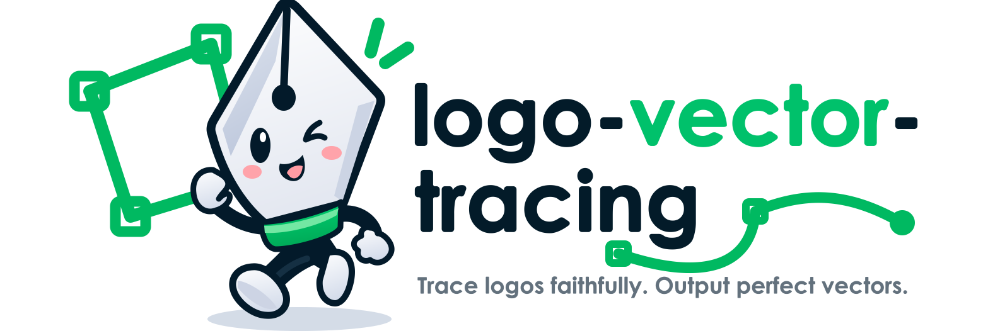
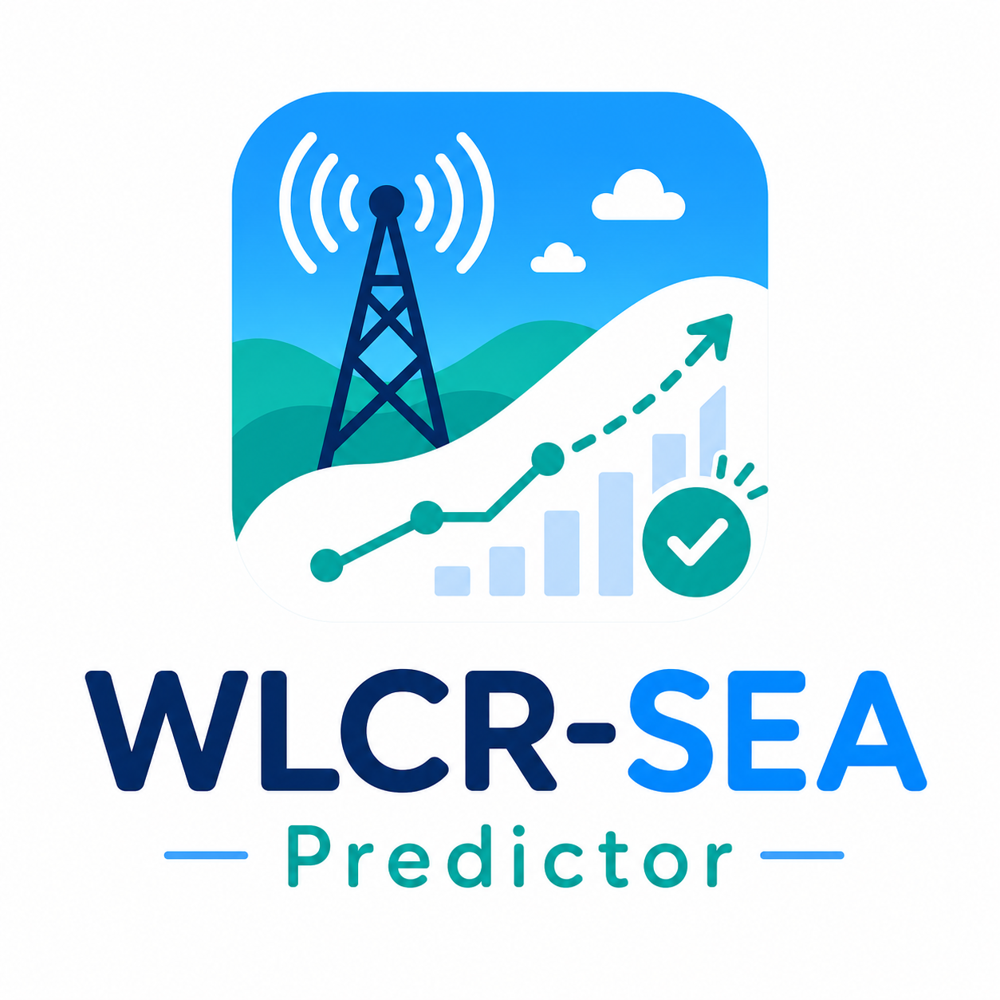
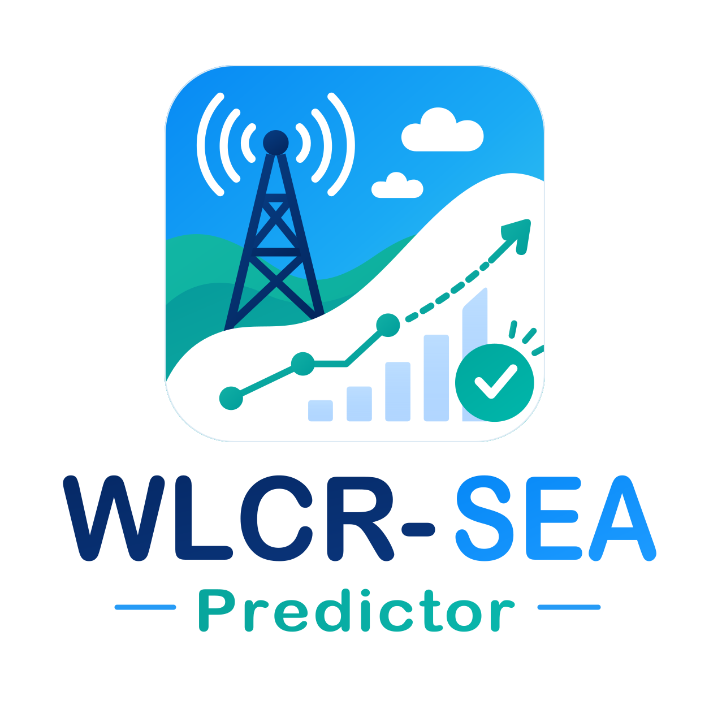

<p align="center">
  <strong>English</strong> · <a href="README_zh.md">中文</a>
</p>

<p align="center">
  
</p>

<h1 align="center">Logo Vector Tracing</h1>

<p align="center">
  <strong>Reference-led reconstruction, type-adaptive geometry, and visual + structural QA</strong><br>
  A reusable ChatGPT/Codex skill for faithfully tracing or repairing logos as polished, editable SVG artwork.
</p>

<p align="center">
  
  
  
  
  
</p>

<p align="center">
  <a href="#overview">Overview</a> ·
  <a href="#case-study">Case Study</a> ·
  <a href="#logo-coverage">Coverage</a> ·
  <a href="#workflow">Workflow</a> ·
  <a href="#fidelity-modes">Fidelity</a> ·
  <a href="#deliverables">Deliverables</a> ·
  <a href="#quick-start">Quick Start</a> ·
  <a href="#validation">Validation</a> ·
  <a href="#repository-map">Repository</a>
</p>

> [!IMPORTANT]
> **This is a quality-controlled vector reconstruction workflow, not a one-click auto-trace preset.** Automated checks can verify SVG structure, but they cannot prove that a silhouette, custom letterform, optical spacing, color relationship, or negative-space idea matches the source. Every project still requires reference-led visual review.

<a id="overview"></a>
## Overview

Logo Vector Tracing closes the full **inspect → classify → measure → reconstruct → compare → validate → deliver** loop. It adapts the construction method to the actual logo instead of forcing every mark through the same auto-trace settings, node density, stroke treatment, or output package.

| Goal | Method | Result |
| --- | --- | --- |
| Preserve brand identity | Measure silhouette, proportions, counters, spacing, color, and distinctive details from the strongest available reference | A reconstruction that reads as the same mark, not a similar redraw |
| Avoid noisy vectorization | Use constrained primitives and a small number of controlled Bézier nodes | Cleaner curves, stable scaling, and easier future editing |
| Respect different logo families | Route geometric, typographic, organic, emblematic, illustrative, and effect-based marks through different construction strategies | A workflow that fits the artwork rather than flattening its character |
| Prevent local defects | Review joins, caps, clipping, winding, tangency, and optical alignment at enlarged scale | No bulbous intersections, floating spikes, hairline seams, or accidental gaps |
| Deliver reliable SVG | Validate XML, `viewBox`, paths, IDs, references, text, and embedded raster policy | Portable, auditable vector files for downstream use |

<a id="case-study"></a>
## Case study: WLCR-SEA Predictor

| Original reference | Final vector master |
| --- | --- |
|  |  |

The included case shows a combined icon-and-wordmark reconstruction, followed by a marked-feedback repair pass for radio-tower intersections and the dashed prediction arrow. It includes the original PNG, review markup, final path-only SVG variants, previews, and brand guide.

**[Open the complete WLCR-SEA Predictor case study →](examples/wlcr-sea-predictor/README.md)**

<a id="logo-coverage"></a>
## Logo coverage

The skill supports single-category and combined marks:

| Logo family | Primary reconstruction focus |
| --- | --- |
| Geometric and abstract symbols | Shared radii, symmetry, boolean relationships, repeated angles, and optical correction |
| Wordmarks, lettermarks, and monograms | Glyph proportions, counters, terminals, ligatures, custom cuts, tracking, and path outlining |
| Organic, hand-drawn, and calligraphic marks | Gesture, pressure variation, intentional irregularity, and economical Bézier control |
| Seals, badges, crests, and emblems | Radial systems, rings, borders, shields, text arcs, and compound-path winding |
| Mascots and illustrative logos | Silhouette, expression, major color regions, identifying features, and scalable detail hierarchy |
| Negative-space and interlocking marks | Positive/negative topology, counters, masks, clipping, and background independence |
| Gradient, transparent, metallic, and effect-based marks | Gradient stops, opacity, blend order, clipping, and identity-critical effects |

<a id="workflow"></a>
## Workflow

```text
[Raster or existing SVG references]
                 |
                 v
      [Inspect + classify logo]
                 |
                 v
        [Measure key geometry]
                 |
                 v
       [Build canonical master]
                 |
                 v
          [Three QA gates]
          |       |       |
        visual  vector  delivery
          |       |       |
          +--- fail -------+
                 |
                 v
          [Repair geometry]
                 |
                 +--------> back to QA

        all gates pass
                 |
                 v
     [Requested variants + release]
```

The three blocking gates are:

| Gate | What is checked | Typical blocking failures |
| --- | --- | --- |
| **1. Visual fidelity** | Silhouette, proportion, negative space, typography, spacing, color, and optical balance | Identity drift, incorrect curves, wrong counters, poor tracking, invented details |
| **2. Vector construction** | Bézier tangency, node economy, joins, caps, winding, masks, clipping, gradients, and shared geometry | Kinks, excess nodes, swollen joints, detached spikes, seams, unresolved references |
| **3. Delivery reliability** | XML parsing, `viewBox`, paths, variant consistency, renderer compatibility, and requested text/raster policy | Invalid SVG, embedded bitmap in path-only delivery, leftover text, broken IDs, mismatched variants |

Passing the script never replaces side-by-side visual comparison.

## Illustrator MCP refinement

For existing AI/SVG artwork with fragmented color regions, seams, or rough edges, use a verified Illustrator MCP connection to preserve the core silhouette, rebuild defective components with controlled Bezier paths and continuous vector gradients, and organize named component layers. See the [Illustrator MCP refinement guide](references/illustrator-mcp-refinement.md).

This route separately checks enlarged edges, true counters versus white sticker borders, doubled strokes on adjacent faces, and reopened AI/SVG exports. Path counts are supporting evidence, not a quality target; an edge repair should not silently change letterforms or become a redesign. Use this route only when Illustrator is relevant; the skill does not install an MCP server.

<a id="fidelity-modes"></a>
## Fidelity modes

| Mode | Use when | Rule |
| --- | --- | --- |
| **Strict trace** | The source is authoritative and sufficiently clear | Reproduce visible geometry and quirks unless they are clearly raster artifacts |
| **Clean reconstruction** | The reference contains compression, noise, scaling damage, or accidental asymmetry | Preserve identity while correcting only defensible defects |
| **Repair** | A usable SVG exists but contains specific local problems | Change only the identified defects and propagate shared fixes |
| **Small-size adaptation** | A favicon or micro-icon must remain legible | Simplify a separate variant without replacing the canonical master |

The skill does not present an invented approximation as tracing. When the source is too small, occluded, distorted, or incomplete, uncertainty must be disclosed.

<a id="deliverables"></a>
## Deliverables

Deliverables follow the request rather than a fixed package. A project may include:

- primary SVG master;
- horizontal, stacked, symbol-only, or wordmark-only lockups;
- reversed, dark-background, monochrome, or print-safe versions;
- favicon or micro-icon adaptations;
- palette and usage notes;
- PNG previews for review;
- a validation report.

Example project structure:

```text
project/
├── references/              # Source references and review markups
├── work/                    # Measurements, generators, and QA renders
└── release/
    ├── logo.svg
    ├── logo-horizontal.svg  # when requested
    ├── logo-dark.svg        # when requested
    ├── favicon.svg          # when requested
    └── brand-guide.md       # when requested
```

<a id="quick-start"></a>
## Quick start

### 1. Clone the skill

macOS / Linux:

```bash
git clone https://github.com/rudykon/logo-vector-tracing.git \
  ~/.codex/skills/logo-vector-tracing
```

Windows PowerShell:

```powershell
git clone https://github.com/rudykon/logo-vector-tracing.git `
  "$env:USERPROFILE\.codex\skills\logo-vector-tracing"
```

Keep `SKILL.md`, `agents/`, `references/`, and `scripts/` together in the skill directory.

### 2. Invoke the skill

```text
$logo-vector-tracing
```

Example request:

```text
Use $logo-vector-tracing to reconstruct this PNG logo as a path-only SVG.
Preserve the custom lettering, negative space, gradients, and corner character.
Create only the primary and dark-background versions, then render both for
side-by-side visual review.
```

The skill asks a question only when a missing choice would materially change the result. Otherwise it selects a fidelity mode, classifies the mark, measures the reference, and begins the reconstruction.

<a id="validation"></a>
## Validation

The validator uses only the Python standard library:

```bash
python3 scripts/validate_svg.py /absolute/path/to/output
```

Path-only delivery rejects `<text>`, `<image>`, and `<foreignObject>` by default. Allow intentional live text or raster elements explicitly:

```bash
python3 scripts/validate_svg.py /absolute/path/to/output --allow-text
python3 scripts/validate_svg.py /absolute/path/to/output --allow-image
```

The validator checks XML parsing, `viewBox`, vector paths, duplicate IDs, external links, and unresolved `url(#id)` references. It does not judge visual fidelity.

<a id="repository-map"></a>
## Repository map

| Path | Purpose |
| --- | --- |
| [`SKILL.md`](SKILL.md) | Entrypoint, fidelity modes, construction principles, and completion gates |
| [`references/tracing-workflow.md`](references/tracing-workflow.md) | Type-adaptive tracing methods, geometry craft, color calibration, and QA |
| [`references/illustrator-mcp-refinement.md`](references/illustrator-mcp-refinement.md) | Illustrator MCP component reconstruction, layers, edge repair, and AI/SVG round-trip checks |
| [`scripts/validate_svg.py`](scripts/validate_svg.py) | Deterministic SVG structure and path-only validation |
| [`agents/openai.yaml`](agents/openai.yaml) | Skill display name, description, default prompt, and invocation policy |
| [`examples/wlcr-sea-predictor/`](examples/wlcr-sea-predictor/) | End-to-end case with source reference, marked review, repaired SVG variants, and previews |
| [`README_zh.md`](README_zh.md) | Chinese documentation |

## Responsible use

- Trace only artwork you are authorized to reproduce or modify.
- Keep private references and unreleased brand assets outside public repositories unless explicitly approved.
- Do not claim pixel-level recovery from a low-resolution or incomplete source.
- Do not treat automated validation as proof of trademark clearance, visual accuracy, font licensing, or renderer compatibility.
- When an official brand guide conflicts with a raster reference, follow the user's chosen authority and document the decision.
