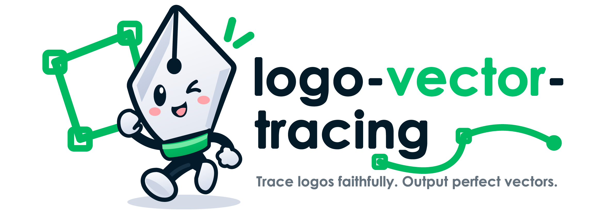

<p align="center">
  <a href="README.md">English</a> · <strong>中文</strong>
</p>

<p align="center">
  
</p>

<h1 align="center">Logo 矢量精细描摹</h1>

<p align="center">
  <strong>参考图驱动重建、类型自适应几何、视觉 + 结构双重质量控制</strong><br>
  将不同类型的 Logo 精确描摹或修复为专业、可编辑 SVG 的通用 ChatGPT/Codex Skill。
</p>

<p align="center">
  
  
  
  
  
</p>

<p align="center">
  <a href="#概览">概览</a> ·
  <a href="#案例">案例</a> ·
  <a href="#logo-类型覆盖">类型覆盖</a> ·
  <a href="#工作流">工作流</a> ·
  <a href="#描摹模式">描摹模式</a> ·
  <a href="#交付内容">交付内容</a> ·
  <a href="#快速开始">快速开始</a> ·
  <a href="#自动校验">自动校验</a> ·
  <a href="#仓库地图">仓库地图</a>
</p>

> [!IMPORTANT]
> **这是一套质量受控的矢量重建工作流，不是一键自动描摹预设。** 自动脚本可以检查 SVG 结构，但不能自动证明轮廓、定制字形、视觉字距、颜色关系或负空间创意与原图一致。每个项目仍然必须依据参考图进行人工视觉复核。

<a id="概览"></a>
## 概览

Logo 矢量精细描摹形成完整的 **检查 → 分类 → 测量 → 重建 → 对照 → 校验 → 交付** 闭环。它会根据实际 Logo 选择构建方法，而不是把所有图形塞进相同的自动描摹参数、节点密度、描边处理或固定交付包。

| 目标 | 方法 | 结果 |
| --- | --- | --- |
| 保持品牌识别 | 从最可靠的参考图测量轮廓、比例、镂空、字距、颜色和标志性细节 | 得到同一标志的重建，而不是概念相似的重画 |
| 避免嘈杂矢量化 | 使用受约束的基础图形和少量可控 Bézier 节点 | 曲线更干净、缩放稳定、后续更容易编辑 |
| 适配不同 Logo 家族 | 对几何、文字、有机、徽章、插画和特效型标志采用不同策略 | 方法服务于原图，而不是抹平原有性格 |
| 阻断局部缺陷 | 放大检查连接、端帽、裁切、绕向、切线和视觉对齐 | 不出现鼓包节点、悬空尖角、发丝缝或意外断口 |
| 形成可靠 SVG | 校验 XML、`viewBox`、路径、ID、引用、文字和嵌入位图策略 | 得到可移植、可审计的下游矢量文件 |

<a id="案例"></a>
## 案例：WLCR-SEA Predictor

| 原始参考图 | 最终矢量母版 |
| --- | --- |
|  |  |

仓库内的完整案例展示了组合型图标与字标的重建，并根据红圈反馈精修通信塔交点和虚线预测箭头。案例包含原始 PNG、审查标注、最终纯路径 SVG 变体、预览图和品牌说明。

**[查看 WLCR-SEA Predictor 完整案例 →](examples/wlcr-sea-predictor/README.md#中文说明)**

<a id="logo-类型覆盖"></a>
## Logo 类型覆盖

本 Skill 支持单一类型与组合型标志：

| Logo 家族 | 主要重建重点 |
| --- | --- |
| 几何图标与抽象标志 | 统一半径、对称、布尔关系、重复角度和视觉修正 |
| 字标、字母标与组合字母 | 字形比例、镂空、端点、连字、定制切口、字距和路径化 |
| 有机、手绘与书法标志 | 手势、压力变化、刻意不规则和精简 Bézier 控制 |
| 印章、徽章、盾徽与纹章 | 径向系统、圆环、边框、盾形、弧形文字和复合路径绕向 |
| 吉祥物与插画型 Logo | 剪影、表情、主要色块、识别特征和可缩放细节层级 |
| 负空间与交叠标志 | 正负形拓扑、镂空、蒙版、裁切和不同背景适应性 |
| 渐变、透明、金属与特效标志 | 渐变节点、透明度、混合顺序、裁切和身份关键特效 |

<a id="工作流"></a>
## 工作流

```text
[位图或现有 SVG 参考]
           |
           v
    [检查并分类 Logo]
           |
           v
      [测量关键几何]
           |
           v
      [建立统一母版]
           |
           v
       [三层质量门禁]
       |       |       |
     视觉门   矢量门   交付门
       |       |       |
       +--- 失败 -------+
           |
           v
       [修复几何]
           |
           +--------> 返回质量门禁

       全部门禁通过
           |
           v
     [按需变体 + 发布]
```

三层阻断性门禁如下：

| 门禁 | 检查内容 | 常见阻断性缺陷 |
| --- | --- | --- |
| **1. 视觉保真门** | 轮廓、比例、负空间、字体、字距、颜色和视觉平衡 | 身份漂移、曲线错误、镂空不对、字距差、虚构细节 |
| **2. 矢量结构门** | Bézier 切线、节点数量、连接、端帽、绕向、蒙版、裁切、渐变和共享几何 | 折点、节点过多、连接鼓包、悬空尖角、发丝缝、引用失效 |
| **3. 交付可靠门** | XML 解析、`viewBox`、路径、变体一致性、渲染器兼容及文字/位图策略 | SVG 无效、路径交付中嵌入位图、残留文字、ID 断裂、变体不一致 |

脚本通过不能替代原图并排对照。

## Illustrator MCP 碎路径精修

针对已有 AI/SVG 的色块接缝、碎路径和边缘毛刺，可通过已验证的 Illustrator MCP 连接保留核心轮廓，用平滑 Bézier 路径和连续矢量渐变重建有缺陷的组件，再按组件建立具名图层。完整方法见 [Illustrator MCP 精修指南](references/illustrator-mcp-refinement.md)。

这一路径单独检查放大的边缘、真实镂空与白色贴纸描边的区别、纸箱等相邻面的重复描边，并重新打开保存的 AI 和 SVG 对照导出。路径数量只是辅助指标；局部修边不应变成未经说明的改字形或重新设计。只有任务需要 Illustrator 时才使用此流程，技能本身不安装 MCP。

<a id="描摹模式"></a>
## 描摹模式

| 模式 | 适用情况 | 规则 |
| --- | --- | --- |
| **严格描摹** | 原图权威且清晰度足够 | 除明显位图噪点外，保留可见几何和细微特征 |
| **清理式重建** | 参考图存在压缩、噪声、缩放损伤或偶发不对称 | 保持身份，仅修复有证据支持的缺陷 |
| **局部修复** | 已有可用 SVG，但存在明确局部问题 | 只修改指定缺陷，并同步共享几何 |
| **小尺寸适配** | favicon 或微型图标必须保持可读 | 单独创建简化变体，不替换统一母版 |

本 Skill 不会把凭空补画的近似版称作描摹。原图过小、被遮挡、发生透视变形或缺少关键信息时，必须说明不确定性。

<a id="交付内容"></a>
## 交付内容

交付内容服从实际请求，不强制固定套装。项目可以包含：

- 主 SVG 矢量母版；
- 横版、竖版、图标版或纯字标版；
- 反白、深色背景、单色或印刷安全版；
- favicon 或微型图标适配版；
- 色板和使用说明；
- 用于审查的 PNG 预览；
- 校验报告。

示例项目结构：

```text
project/
├── references/              # 原始参考图与审查标记
├── work/                    # 测量记录、生成器和 QA 渲染
└── release/
    ├── logo.svg
    ├── logo-horizontal.svg  # 按需
    ├── logo-dark.svg        # 按需
    ├── favicon.svg          # 按需
    └── brand-guide.md       # 按需
```

<a id="快速开始"></a>
## 快速开始

### 1. 克隆 Skill

macOS / Linux：

```bash
git clone https://github.com/rudykon/logo-vector-tracing.git \
  ~/.codex/skills/logo-vector-tracing
```

Windows PowerShell：

```powershell
git clone https://github.com/rudykon/logo-vector-tracing.git `
  "$env:USERPROFILE\.codex\skills\logo-vector-tracing"
```

请保持 `SKILL.md`、`agents/`、`references/` 和 `scripts/` 位于同一 Skill 目录中。

### 2. 调用 Skill

```text
$logo-vector-tracing
```

示例请求：

```text
使用 $logo-vector-tracing，把这张 PNG Logo 严格重建为纯路径 SVG。
保留定制字形、负空间、渐变和圆角特征。只创建主版和深色背景版，
然后把两个版本渲染出来与原图并排检查。
```

只有缺少会显著改变结果的关键选择时，Skill 才会提问；否则会确定描摹模式、识别 Logo 类型、测量参考图并开始重建。

<a id="自动校验"></a>
## 自动校验

校验器仅使用 Python 标准库：

```bash
python3 scripts/validate_svg.py /absolute/path/to/output
```

纯路径交付默认拒绝 `<text>`、`<image>` 和 `<foreignObject>`。如果交付明确允许可编辑文字或位图元素，可显式放行：

```bash
python3 scripts/validate_svg.py /absolute/path/to/output --allow-text
python3 scripts/validate_svg.py /absolute/path/to/output --allow-image
```

校验器会检查 XML 解析、`viewBox`、矢量路径、重复 ID、外部链接及未解析的 `url(#id)` 引用，但不会判断视觉保真度。

<a id="仓库地图"></a>
## 仓库地图

| 路径 | 用途 |
| --- | --- |
| [`SKILL.md`](SKILL.md) | 入口说明、描摹模式、构建原则和完成门禁 |
| [`references/tracing-workflow.md`](references/tracing-workflow.md) | 类型自适应描摹、几何工艺、颜色校准和质量审查 |
| [`references/illustrator-mcp-refinement.md`](references/illustrator-mcp-refinement.md) | Illustrator MCP 组件重建、图层组织、边缘修复及 AI/SVG 导出复核 |
| [`scripts/validate_svg.py`](scripts/validate_svg.py) | SVG 结构与纯路径交付的确定性校验 |
| [`agents/openai.yaml`](agents/openai.yaml) | Skill 显示名称、描述、默认提示词和调用策略 |
| [`examples/wlcr-sea-predictor/`](examples/wlcr-sea-predictor/) | 包含原图、红圈审查、修复后 SVG 变体和预览的完整案例 |
| [`README.md`](README.md) | 英文说明 |

## 负责任使用

- 只描摹已获得复制或修改授权的作品；
- 私人参考图和未发布品牌素材未经明确许可不得进入公开仓库；
- 不得声称能从低分辨率或不完整原图恢复像素级细节；
- 不得把自动校验当作商标许可、视觉准确、字体授权或渲染器兼容性的证明；
- 官方品牌指南与位图参考冲突时，应采用用户指定的权威来源并记录决定。
