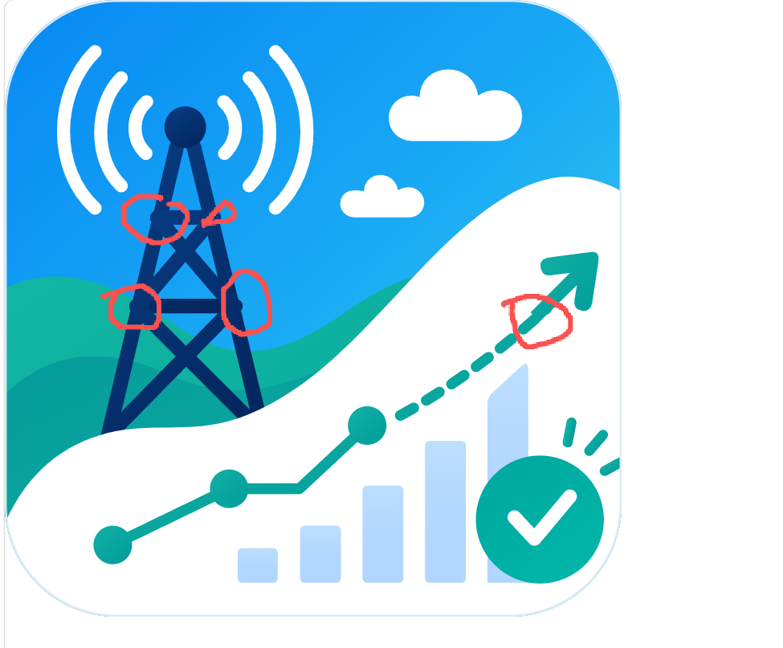
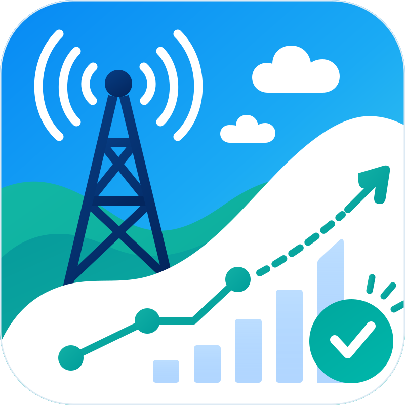

# WLCR-SEA Predictor — vector tracing case study

[中文说明](#中文说明)

This case records a reference-led reconstruction and focused repair pass for a combined logo: a rounded app icon, radio tower, coastal landscape, forecast chart, validation badge, and custom wordmark.

> The source artwork and review markup are included with the owner's permission for this private repository. They are documentation inputs, not embedded parts of the SVG deliverables.

## Reference and result

| Original PNG reference | Final vector master |
| --- | --- |
|  |  |

| Marked review | Repaired detail preview |
| --- | --- |
|  |  |

## Reconstruction brief

- **Source:** 1254 × 1254 PNG.
- **Logo family:** combined illustrative icon + analytics symbol + custom wordmark.
- **Fidelity mode:** reference-led clean reconstruction, followed by local repair from marked feedback.
- **Delivery policy:** outlined lettering and path-only SVG; no `<text>`, `<image>`, or `<foreignObject>` elements.
- **Shared master:** the app-icon geometry is reused across the full, horizontal, dark, icon, and favicon variants.

## What required careful tracing

1. **White prediction surface** — rebuilt as a controlled Bézier boundary that preserves the distinctive rising data region instead of using a generic wave.
2. **Radio tower** — separated into mast legs, crossbars, and diagonal braces so intersections remain clean at large scale.
3. **Forecast graphic** — reconstructed with three solid nodes, five translucent bars, a tangent-aligned dashed segment, a separate solid shaft, and a custom arrowhead.
4. **Wordmark** — converted to vector outlines so the deliverables do not depend on an installed font; the `SEA` gradient and `Predictor` spacing are retained in the master lockup.
5. **Color system** — preserved the sky gradient, layered teal terrain, deep-blue tower, translucent blue bars, and teal verification mark.

## Repair pass from the marked review

The red circles identified four local defects. The repair pass:

- replaced overlapping round-capped tower strokes with layered, butt-capped structural members;
- aligned braces and crossbars to remove swollen joints and tiny protruding spikes;
- separated the dashed forecast trajectory from the solid terminal shaft;
- redrew and tangent-aligned the custom arrowhead so the transition reads as one continuous motion.

These are transferable checks: inspect every high-contrast intersection and every stroke-to-shape transition at enlarged scale, not only at the final display size.

## Deliverables

| File | Purpose |
| --- | --- |
| [`output/logo.svg`](output/logo.svg) | Complete primary lockup |
| [`output/logo-icon.svg`](output/logo-icon.svg) | App icon |
| [`output/logo-horizontal.svg`](output/logo-horizontal.svg) | Horizontal lockup |
| [`output/logo-dark.svg`](output/logo-dark.svg) | Dark-background version |
| [`output/favicon.svg`](output/favicon.svg) | Small-size icon adaptation |
| [`output/brand-guide.md`](output/brand-guide.md) | Palette, sizing, and usage notes |

Validate the vector outputs from the repository root:

```bash
python scripts/validate_svg.py examples/wlcr-sea-predictor/output
```

This case illustrates the workflow; it is not a fixed template for other logos. A different mark may require geometric construction, organic curve tracing, emblem topology, typography-first reconstruction, or another category-specific route.

---

<a id="中文说明"></a>
## 中文说明

这个案例记录了 WLCR-SEA Predictor 组合型 Logo 的参考图驱动重建，以及依据红圈反馈进行的局部精修。图形由圆角 App 图标、通信塔、海岸景观、预测图表、验证标记和定制字标组成。

- 原始参考图为 1254 × 1254 PNG；
- 采用“清理式重建 + 局部修复”模式；
- 字体全部路径化，SVG 中不含 `<text>`、`<image>` 或 `<foreignObject>`；
- 白色预测区域、通信塔桁架、三节点折线、半透明柱状图、虚线预测段和特殊箭头均以独立 Bézier/路径结构重建；
- 红圈修复重点是消除塔架交点鼓包、细小尖刺，并让虚线、实线箭杆和箭头沿同一运动切线衔接。

案例同时保留输入参考、用户审查标注、最终 SVG 套件和前后预览，便于复核“发现问题 → 局部修复 → 全变体同步 → 结构校验”的完整闭环。它只用于展示方法，不应作为其他 Logo 的固定模板。

